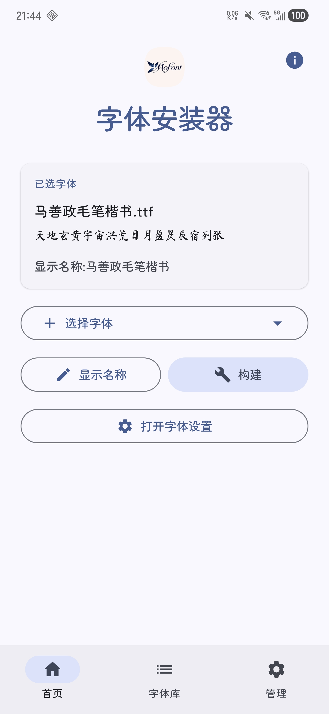
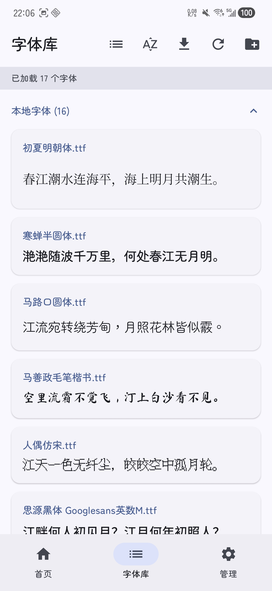
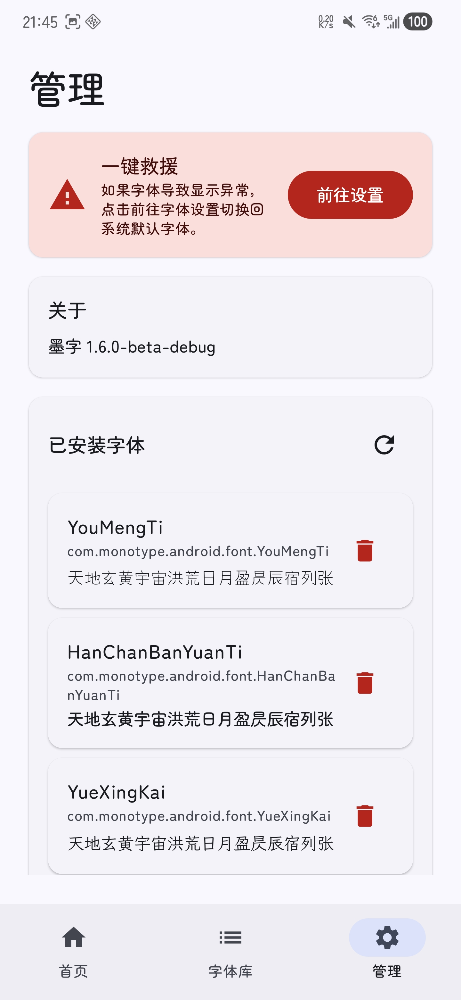

## MoFont 墨字

基于 [Fonts Manager](https://github.com/jeeneo/fonts) 二次开发

在 One UI 8 上免 root 安装自定义字体，支持 Shizuku

> [!IMPORTANT]
> **仅支持 One UI 8**，不支持 One UI 5.1 / 6.1 / 7 / 8.5 等其他版本。

> [!WARNING]
> 本工具仅支持**本地替换字体**，仅供学习交流使用。请勿安装仅限商用授权的字体，因使用本工具安装字体所产生的一切版权纠纷与法律责任，均与本项目及开发者无关。

> [!CAUTION]
> **当前版本不支持数字开头的字体文件名**。如果字体文件名以数字开头（如 `123Font.ttf`），安装将会失败。请先手动重命名 `.ttf` 文件，确保文件名以字母或汉字开头（如 `Font123.ttf`、`字体123.ttf`）。

> [!NOTE]
> 本项目为个人自用项目，不会再积极维护或发布新版本。Issues 和 PR 可能不会得到回复，请谅解。

<table align="center">
<tr>
<td align="center">

</td>
<td align="center">

</td>
<td align="center">

</td>
</tr>
</table>
